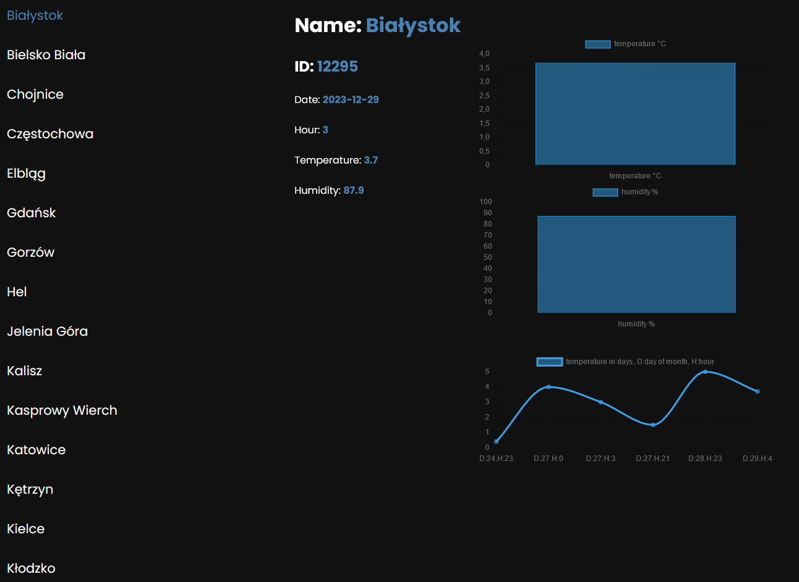

# [stationInformation](https://stationinformation.netlify.app/)

## Table of content

- [Overwiev](#overview)
    - [The task](#the-task)
- [Presentation](#presentation)
    -[Deploy](#deploy)
- [Process](#process)
    - [Build with](#build-with)
    - [What I've learned](#what-ive-learned)
- [Author](#author)

### Welcome

This is my solution to one of my collage project, that i really liked

## Overview

### The task

The task was to implement an app that would be able to:
- fetch data from api
- show all of the stationes
- on click each station should give us information about itself
- each information could be clicked and picked to show on the timeline
- informations shold not be longer than 1 week in the localStorage (that means we have chart with values from at most a week)
- 3 graphs, temperature, humidity, and the third graph that contains all of the informations about your picked type of information (temperature, humidity, airpressure, windspeed, rainfall) from past week

## Presentation

### Deploy

You can check out my website right there --> [stationInformation](https://stationinformation.netlify.app/)

## Process

### Build with

- parcel
- module exports
- chart.js
- localStorage

### What I've learned

it was a good training about fetching data, functional programming, objects, arrays, libraries and business logic

## Author

- my github profile - [xmavv](https://github.com/xmavv)
- my frontend mentor profile - [@xmavv](https://www.frontendmentor.io/profile/xmavv)
- my behance profile - [mav](https://www.behance.net/mavrgb)
